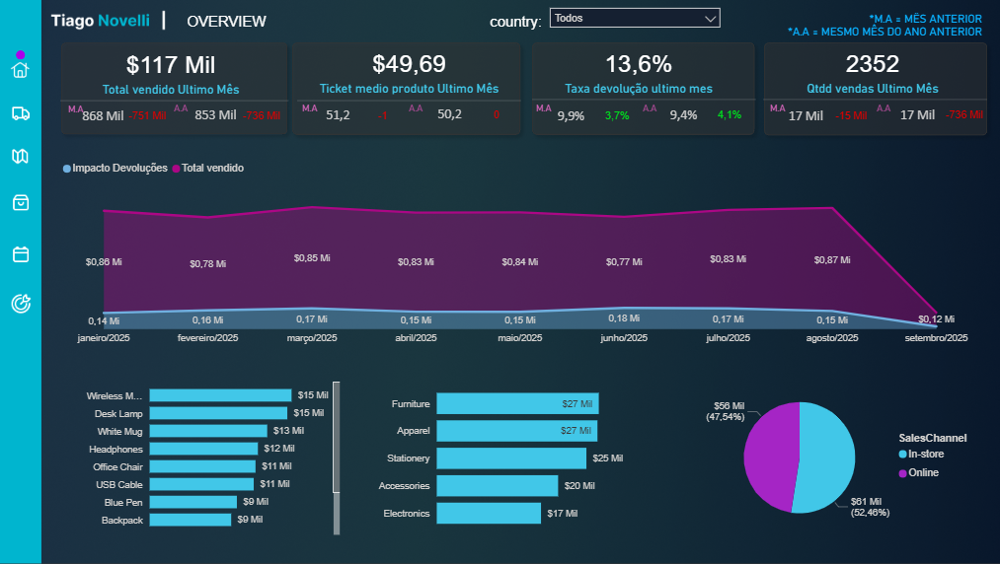
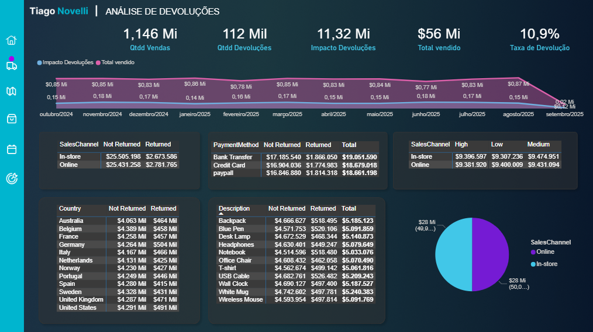
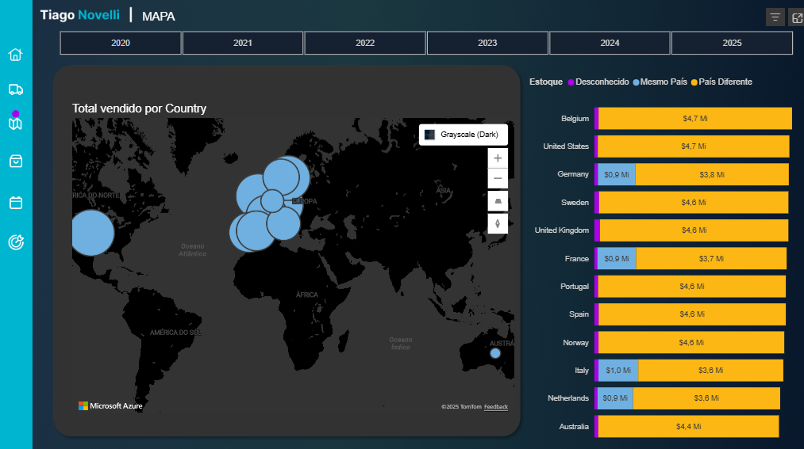
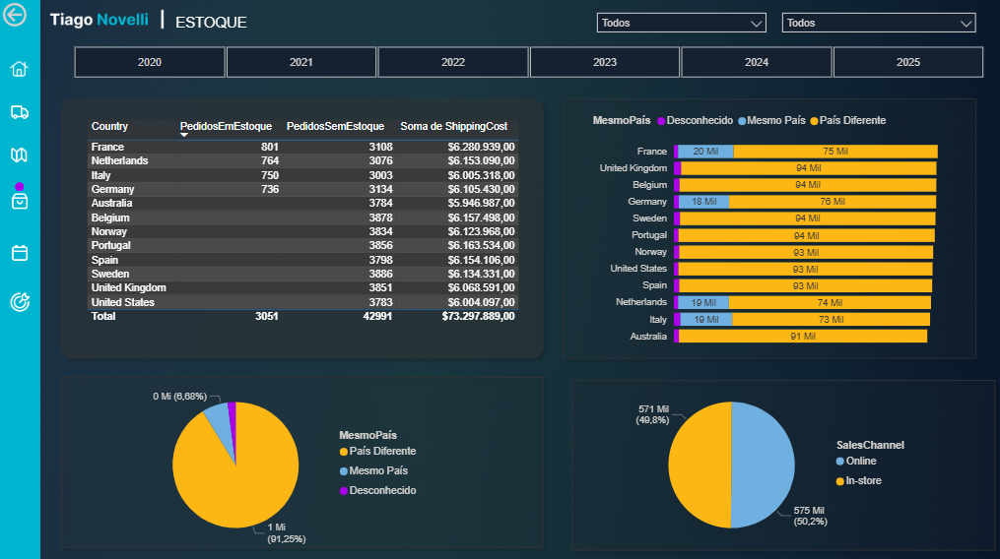
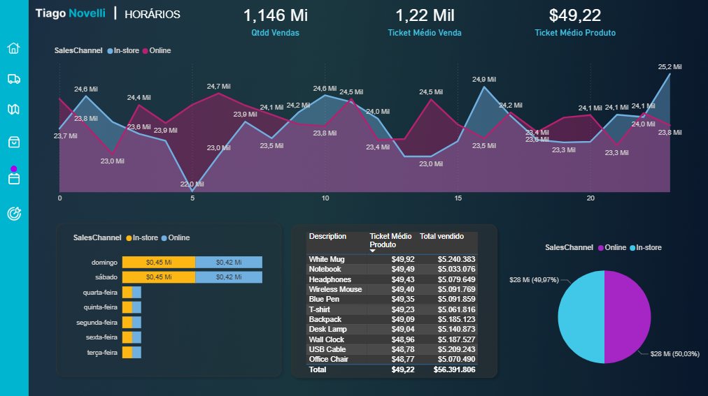
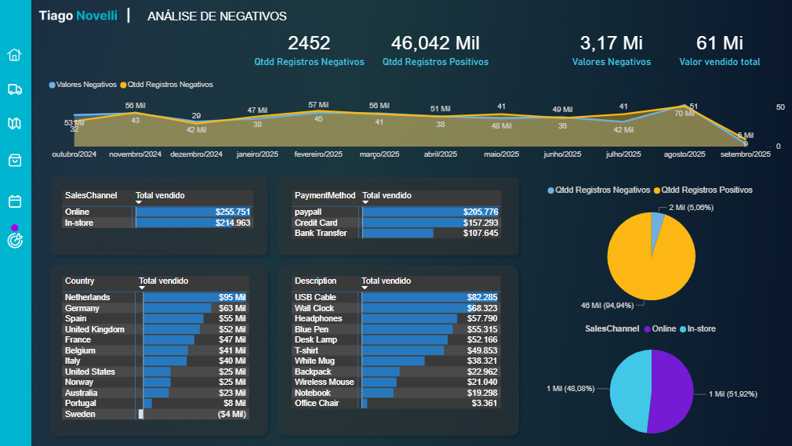
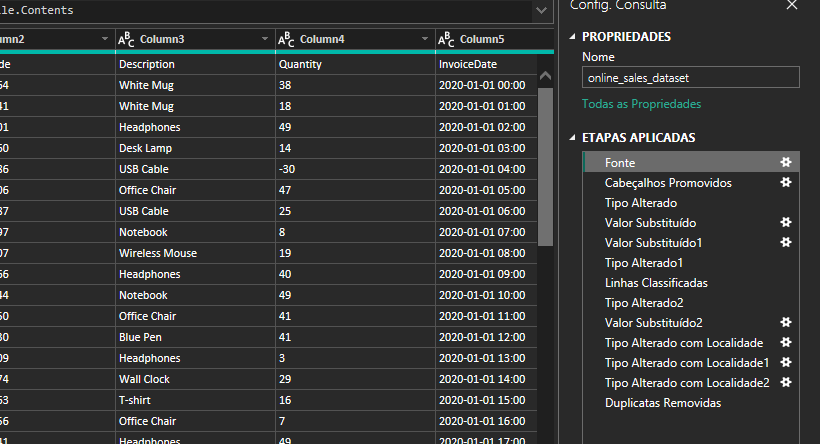
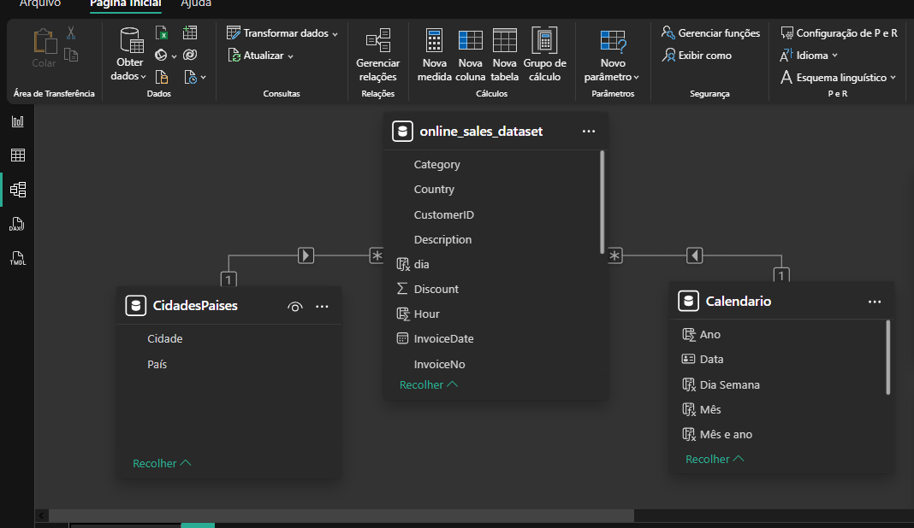
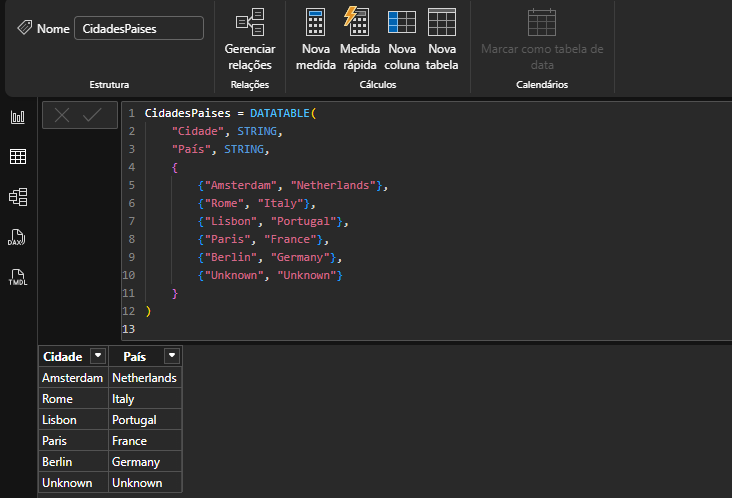

# 📊 Análise de Vendas Online - Power BI

## 📝 Sobre o Dataset

O **Online Sales Dataset** da Kaggle contém dados anonimizados de transações de vendas online, capturando diversos aspectos das compras de produtos, detalhes dos clientes e características dos pedidos.

### Potencial Analítico
Este dataset permite:
- Análise de tendências de vendas e padrões de comportamento de compra
- Avaliação do desempenho operacional e gestão de pedidos
- Estudo do impacto de descontos e métodos de pagamento no desempenho de vendas
- Otimização de inventário através da análise de demanda por produtos
- Melhoria da satisfação do cliente através do tratamento de devoluções e entregas

**Links:**
- [Projeto Publicado no Power BI](https://app.powerbi.com/view?r=eyJrIjoiZmZlMmEwYTQtN2MyMC00ZjNmLWI5NWMtYmI2Njk3MDMzM2ViIiwidCI6IjZjMjNjYmUxLTkyOWQtNDEzYS1hNzYwLTNjOWQ5NDkwZTE0OSJ9)
- [Dataset Original no Kaggle](https://www.kaggle.com/datasets/yusufdelikkaya/online-sales-dataset)

---

## 💡 Principais Insights

### 🏠 Home - Visão Geral do Desempenho

- **KPIs focados no mês mais recente** com comparação ao mês anterior e mesmo período do ano anterior
- Variações significativas observadas em categorias, produtos e canais de venda
- Dashboard projetado para responder à primeira necessidade do negócio: **desempenho atual**

### 🔄 Devoluções - Operação Altamente Previsível

**Descoberta-chave:** A distribuição de devoluções é **uniforme** em todos os contextos analisados.

- ✅ **Ausência de padrões sazonais** nas devoluções
- ✅ **Distribuição equilibrada** entre canais online (50% cada)
- ✅ **Uniformidade** entre países, produtos, métodos de pagamento e prioridades de entrega
- ✅ **Prioridades de entrega igualmente distribuídas** (Alta, Média, Baixa)

**Métrica Criada:** *Impacto de Devoluções* = Valor da Venda Devolvida + Custo de Frete a Reembolsar

#### 💼 Implicações Estratégicas
A previsibilidade extrema das devoluções permite:
- Melhor controle financeiro e previsão de fluxo de caixa
- Previsão de estoque mais precisa
- Redução de gastos desnecessários no varejo

#### 🧪 Oportunidade de Teste A/B
**Proposta:** Testar se todas as vendas com prioridade baixa manteriam o mesmo desempenho, gerando **economia no custo de entrega**.

### 🗺️ Distribuição Geográfica

- **Concentração principal de clientes na Europa**
- Necessidade de estratégias específicas por região

### 📦 Estoque - Ineficiência Logística Identificada

**Problema crítico detectado:**
- Apenas **6% das compras** são atendidas pelo estoque do próprio país
- Apenas **4 de 12 países** possuem warehouse local
- Mesmo com warehouse local, só atendem **6% das vendas**

**⚠️ Anomalia:** Comportamento incomum para uma operação tão previsível.

**💰 Oportunidade de Economia:** Redução significativa de custos com **entrega internacional** através de melhor distribuição de estoque.

### ⏰ Análise Temporal - Padrões de Compra

**Descobertas comportamentais:**
- 📈 **Fins de semana:** Vendas quase **8x maiores** que dias úteis
- ⚖️ **Equilíbrio entre canais:** Quando vendas aumentam em um canal, diminuem no outro (pontos de inversão)
- 💵 **Ticket médio homogêneo:** Nenhum produto se destaca significativamente para promoções específicas

### ⚠️ Registros Negativos - Área de Atenção

Representam **~6% dos registros** com maior variabilidade.

**Características:**
- **Quantidade negativa** e **valores negativos** na maioria dos casos
- Possíveis causas: devoluções, cancelamentos, abandonos de carrinho
- **Canal Online** apresenta mais registros negativos (abandono de carrinho)
- **PayPal** é a forma de pagamento mais frequente nesses casos
- **Netherlands** se destaca: compras em loja física são **2x maiores** que online

---

## 🔧 Tratamento dos Dados

### Limpeza e Padronização

- **Warehouse Location:** Valores `NULL` substituídos por `"Unknown"`
- **Colunas de ID:** Convertidas para formato de texto
- **Números decimais:** Conversão utilizando localização apropriada

### Filtros e Segmentação
**Registros sem Customer ID:**
- Quantidade negativa identificada
- Valores negativos na maioria dos casos
- Interpretação: possíveis devoluções, cancelamentos ou abandonos de carrinho
- **Ação tomada:** Filtrados para análise separada (tela específica de registros negativos)

### Modelo de Dados
- Criação de tabela calendário

- Implementação de **modelo Star Schema** no banco de dados

- Criação de tabela de relacionamento de cidades com países

### Dashboards Criados
Seis telas principais no Power BI:
1. **Home** - KPIs e visão geral
2. **Devoluções** - Análise de impacto e padrões
3. **Mapa** - Distribuição geográfica
4. **Estoque** - Análise logística
5. **Horários** - Padrões temporais de compra
6. **Registros Negativos** - Análise de anomalias

---

## 🚀 Oportunidades de Análises Futuras

### 👥 Comportamento do Cliente
- **Análise por Customer ID:** Padrões de compra individuais
- **Histórico de compras:** Clientes já compraram na loja anteriormente?
- **Segmentação de clientes:**
  - Quantidade de clientes comprando **novamente** (retenção)
  - Quantidade de **primeiros clientes** (aquisição)
  - Taxa de conversão de novos clientes em clientes recorrentes

### 📊 Análises Avançadas Sugeridas
- **Customer Lifetime Value (CLV):** Valor do cliente ao longo do tempo
- **Análise de coorte:** Comportamento por grupo de aquisição
- **RFM (Recency, Frequency, Monetary):** Segmentação por valor
- **Churn prediction:** Identificação de clientes em risco de abandono
- **Cross-selling e Up-selling:** Produtos frequentemente comprados juntos
- **Sazonalidade por cliente:** Padrões de compra individuais ao longo do ano

### 🎯 Otimizações Operacionais
- **Teste A/B de prioridade de entrega:** Validar economia com prioridade única
- **Redistribuição de estoque:** Modelagem de cenários para reduzir entregas internacionais
- **Análise de abandono de carrinho:** Estratégias de recuperação para canal online
- **Otimização de warehouse:** Localização ideal de novos centros de distribuição

---

**Análise desenvolvida em:** 26/10/2025 

**Ferramenta:** Power BI  

**Dataset:** Online Sales Dataset (Kaggle)
